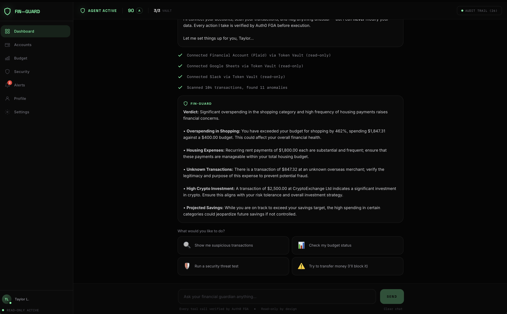

# Fin-Guard

### Read-Only AI Financial Guardian

> Your money. Our watch. Zero write access. Full transparency.



**[Live Demo](https://fin-guard.xiangliu.net)** | **[Devpost](https://devpost.com/software/fin-guard)**

---

## What is Fin-Guard?

Fin-Guard is an AI-powered financial monitoring agent that can tell you everything about your money but can **never touch a cent of it**. Built on Auth0's full security stack, every action the agent takes is authorized, audited, and reversible.

When you open the app, the AI agent takes over immediately: connects your accounts, scans transactions, detects anomalies, and reports findings. No manual setup. No clicking buttons. The agent does everything.

## Auth0 Security Stack

| Feature | How Fin-Guard Uses It |
|---------|----------------------|
| **Token Vault** | Read-only scoped OAuth tokens via RFC 8693 token exchange. The agent never sees raw credentials. |
| **FGA** | Every tool call is pre-checked against a Fine-Grained Authorization model. Write access is permanently blocked. |
| **CIBA** | High-risk findings (>$1,000) trigger push notifications. The agent pauses until the human approves or denies. |

## Features

- **Agentic Dashboard** -- AI auto-onboards, connects services, and analyzes your finances in seconds
- **Conversational AI** -- Ask anything about your spending, budget, or anomalies
- **Interactive Threat Lab** -- 5 attack scenarios you can run against the security model
- **Dynamic Security Score** -- 0-100 gauge across 5 dimensions (Token Vault, FGA, CIBA, Audit, Zero-Trust)
- **Per-Session Isolation** -- Every visitor gets a unique randomly generated profile
- **Full Audit Trail** -- Every API call, permission check, and blocked attempt logged

## Tech Stack

- **Frontend**: Next.js 15, Tailwind CSS, TypeScript (Vercel)
- **Backend**: FastAPI, Python (Render)
- **AI**: OpenAI GPT-4o-mini
- **Auth**: Auth0 Token Vault + FGA + CIBA
- **DNS**: Cloudflare

## Pages

| Page | Description |
|------|-------------|
| `/` | Landing page |
| `/dashboard` | AI agent console (main interface) |
| `/accounts` | Bank accounts overview |
| `/accounts/[id]` | Account detail with transactions |
| `/budget` | Budget planner with category breakdown |
| `/security` | Threat Lab + Security Score + FGA Model + Audit Trail |
| `/alerts` | CIBA approval queue |
| `/profile` | User profile with FICO score |
| `/settings` | Connections, notifications, AI config |

## Quick Start

### Backend
```bash
cd backend
pip install -r requirements.txt
cp .env.example .env  # Add your Auth0 + OpenAI credentials
uvicorn app.main:app --reload --port 8000
```

### Frontend
```bash
cd frontend
npm install
npm run dev
```

Open http://localhost:3000

## Environment Variables

| Variable | Description |
|----------|-------------|
| `AUTH0_DOMAIN` | Auth0 tenant domain |
| `AUTH0_CLIENT_ID` | Auth0 application client ID |
| `AUTH0_CLIENT_SECRET` | Auth0 application client secret |
| `OPENAI_API_KEY` | OpenAI API key (GPT-4o-mini) |
| `APP_SECRET_KEY` | Session secret key |
| `BACKEND_URL` | Backend URL (for Vercel deployment) |

## License

Built for the [Auth0 "Authorized to Act" Hackathon](https://auth0.devpost.com/) 2025.
